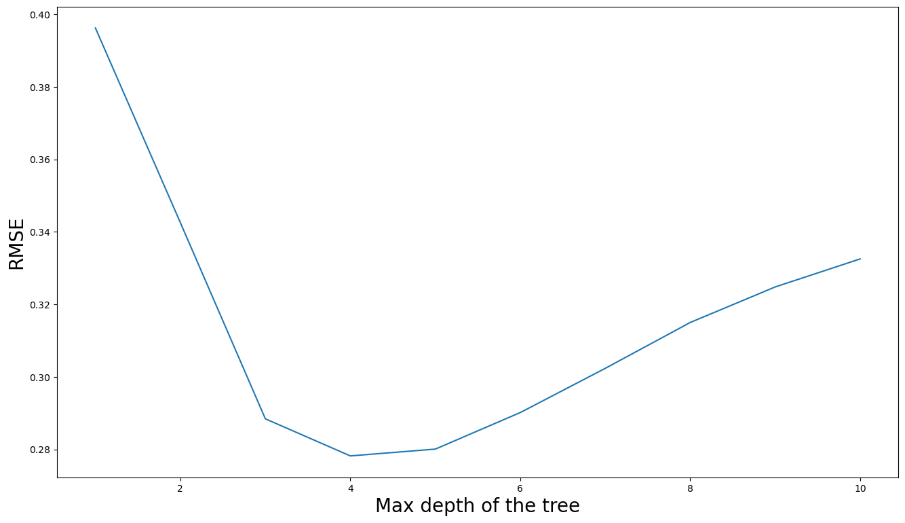
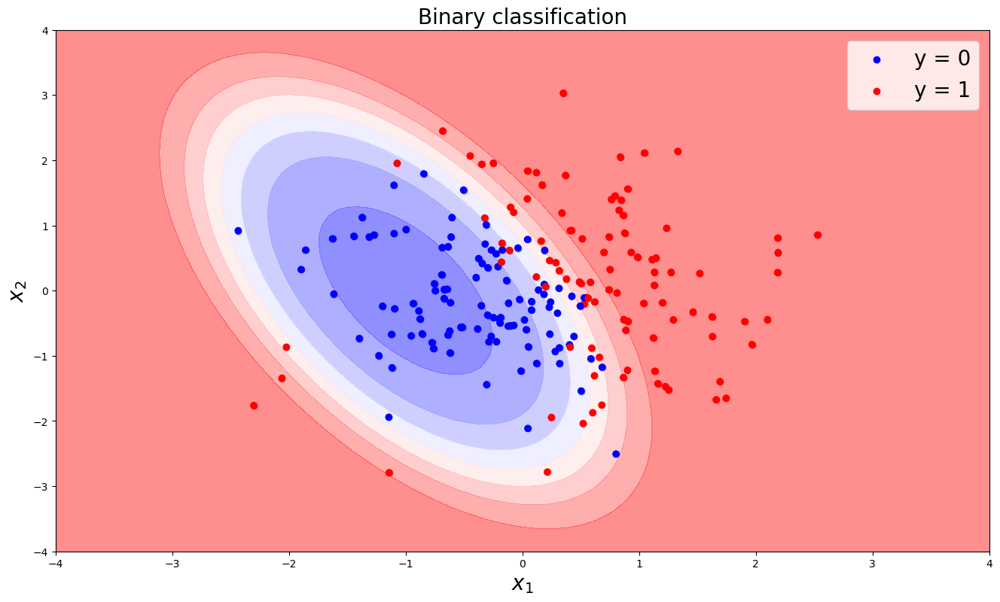

# Decision-Trees

The goal of this project is to implement and visualize decision trees. We study using simple examples both examples of classification and regression. Cross-validation procedures are used to tune the important parameters of the trees. Monte Carlo methods, using an ensemble of decision trees, are also discussed.

## Regression Trees
We start by a simple regression problem : predition of sinus function. We optimize the depth of the regression tree using cross validation.

We also try a forest regressor. We obtain the following result:

## Binary classification

 We used in this part a binary classification on the Titanic historical dataset. The goal is to understand the rules infered by the classification tree to predict the output variable (i.e., did people died or survived).

 After choosng the best depth fr the classification tree using cross validation, we obtain the following graph.

 

As explained in the notebook, this graph shows that young men are more likely to die compared to others especially if they aren't in first class and have a big family size. We can explain that by the fact that women, children, elderly and men with high social status were more protected during the titanic tragedy and their survival was more prioritized.

## Multiple trees for binary classification
We consider in this part another binary classification problem. The goal is to visualize the results of decision trees in nonlinear problems.

We compare the accuracy score obtained using classification trees with different depths, a random forest with depth 3 and an ada boost classifier.

